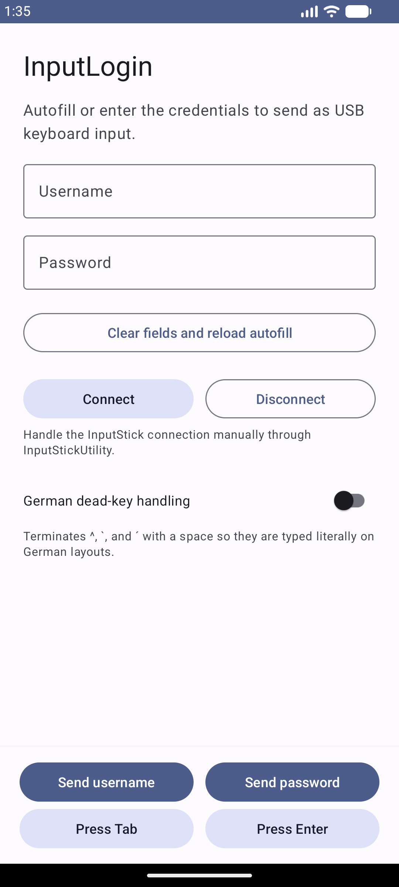
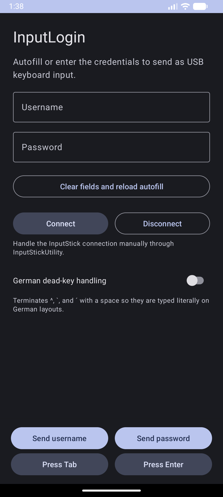
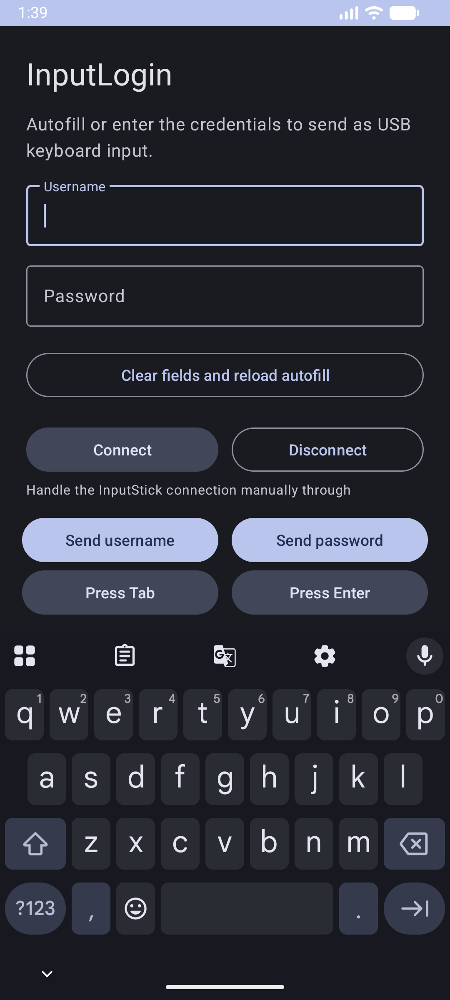

# InputLogin

InputLogin is an Android companion app for the InputStick. It acts as a bridge between a password manager supporting autofill and the InputStick.
It provides the user with a login form and buttons to send the login data to the target device featuring a InputStick.

## Use Cases 
- Autofill BitLocker keys
- Autofill BIOS / UEFI passwords

## Requirements

- An [InputStick](https://www.inputstick.com/) connected to the target computer or device.
- A mobile device running Android.
- [InputStickUtility](https://github.com/inputstick/InputStickAPI-Android) installed and configured.
- (Optional) A password manager that supports Android Autofill.

## Usage

1. Plug the InputStick into the target computer or device.
2. Make sure the InputStick is configured in InputStickUtility.
3. Autofill the username and password from your password manager.
4. Use the send controls in the order required by the login form, for example:
   **Send Username → Tab → Send Password → Enter**.

## Screenshots

## Keyboard layout

InputStick behaves like a USB keyboard, so the characters produced depend on the keyboard layout selected on the target system and the keyboard layout selected in the InputStickUtility app.

If both are selected correctly and special characters are still don't function correctly special dead-key behavior may be necessary. 
The app comes equipped with a **German dead-key handling** option that types a space after these special keys.

## Functionality and Security

- InputLogin targets the same SDK (32) as InputStickUtility leading to initial system warnings regarding the old version.
- The password field is masked and treated as a password input by Android.
- Credentials are only sent to the target when you use the corresponding send control.
- Pressing the clear button will delete the strings entered and refresh the activity to allow a new autofill prompt.
- The app communicates with **InputStickUtility** through the broadcast interface provided by the [InputStick Android API](https://github.com/inputstick/InputStickAPI-Android).
- The broadcast is restricted and can only be received by the com.inputstick.apps.inputstickutility package.
- **Connect** and **Disconnect** are optional as the connection is handled by InputStickUtility.